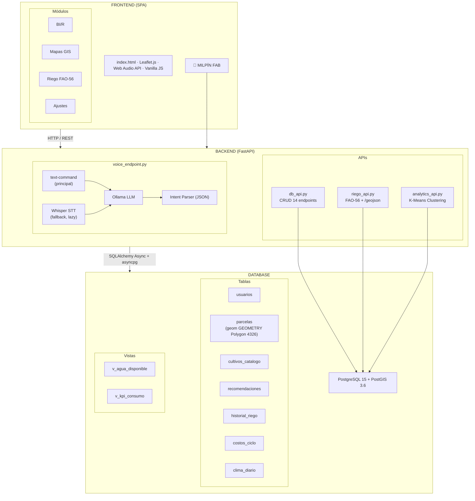
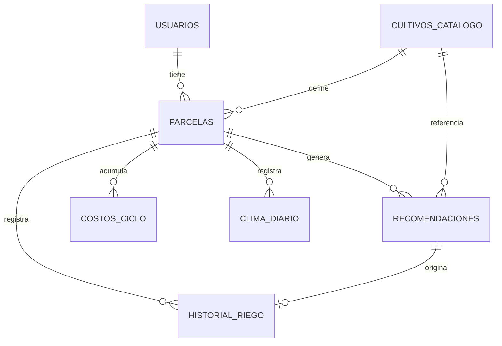
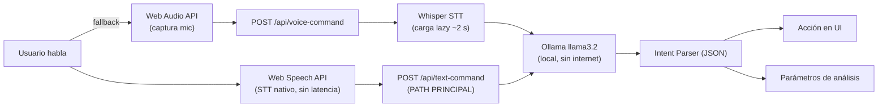

<div align="center">

<h1>🌾 MILPÍN AgTech</h1>
<h3>Sistema Inteligente de Optimización de Riego — Valle del Yaqui, DR-041</h3>
<p>
  
  
  
  
</p>
<p>
  
  
  
  
  
</p>
<p>
  
  
</p>
<blockquote>
<strong>Meta principal:</strong> Reducir el consumo hídrico de <code>8,000 m³/ha/ciclo</code> a <code>6,000 m³/ha/ciclo</code> — un ahorro del <strong>25%</strong> equivalente a ~$1.68 MXN/m³ (tarifa CFE 9-CU, bombeo 80 m).
</blockquote>
</div>

---

## Tabla de Contenidos

- [¿Qué es MILPÍN?](#-qué-es-milpín)
- [Estado del proyecto](#-estado-del-proyecto)
- [Deuda técnica vigente](#-deuda-técnica-vigente)
- [Características principales](#-características-principales)
- [Arquitectura del sistema](#-arquitectura-del-sistema)
- [Stack tecnológico](#-stack-tecnológico)
- [Estructura del proyecto](#-estructura-del-proyecto)
- [API Reference](#-api-reference)
- [Base de datos](#-base-de-datos)
- [Instalación y uso](#-instalación-y-uso)
- [Frontend (SPA)](#-frontend-spa)
- [Motor FAO-56](#-motor-fao-56)
- [Asistente de voz MILPÍN AI](#-asistente-de-voz-milpín-ai)
- [Roadmap de interfaz](#️-roadmap-de-interfaz)

---

## ¿Qué es MILPÍN?

**MILPÍN** es un DDS (Decision Support System) agrícola inteligente diseñado para los productores del **Distrito de Riego DR-041 (Valle del Yaqui, Sonora, México)**. Combina modelos agronómicos científicos, inteligencia artificial local y visualización geoespacial para brindar recomendaciones de riego precisas, controlables por voz.

> El nombre honra a la **milpa**, el sistema agrícola ancestral mesoamericano, fusionándolo con tecnología de punta.

**Usuarios objetivo:** Productores, técnicos de campo y administradores del módulo DR-041.

---

## Estado del proyecto

**Fase actual: DSS — core técnico sólido, bloqueador único: autenticación**

### ✔ Implementado y funcionando

| Componente | Detalle | Fecha |
|---|---|---|
| Backend FastAPI 2.0 | Lifespan, 4 routers, SQLAlchemy 2.0 async | — |
| PostgreSQL 15 + **PostGIS 3.6** | `parcelas.geom` es `GEOMETRY(Polygon,4326)` con índice GIST. Migrado desde JSONB vía Alembic `0001_postgis_geom_jsonb_to_geometry`. | 2026-04-30 |
| 7 modelos ORM, 14 endpoints CRUD | 2 vistas KPI, seeders, `schema.sql` | — |
| `GET /api/parcelas/geojson` | GeoJSON FeatureCollection listo para Leaflet, servido desde PostGIS | 2026-04-30 |
| Motor agronómico FAO-56 | Penman-Monteith (`balance_hidrico.py`), Hargreaves como fallback. Conectado a BD: lee parcela + cultivo + clima, persiste en `recomendaciones`. | — |
| **Alembic activo** | `backend/migrations/` + `alembic.ini`. Próximas migraciones con `alembic revision -m "descripcion"` + `alembic upgrade head`. | 2026-04-30 |
| **77 tests** | 42 unitarios FAO-56 (`test_fao56_unit.py`) + 35 e2e con SQLite/aiosqlite (`test_riego_e2e.py`). Ejecutar con `pytest backend/tests/`. | 2026-05-01 |
| **Loop recomendación→feedback completo** | `PATCH /recomendaciones/{id}/feedback` actualiza estado y auto-inserta en `historial_riego` cuando `aceptada` es `"aceptada"` o `"modificada"`. Verificado con `TestFeedbackLoop` (7 casos). | 2026-05-01 |
| Pipeline de voz | Whisper STT **carga lazy** (startup ~2 s vs. ~45 s anterior) → Ollama `llama3.2:latest` → Web Speech API TTS | 2026-04-30 |
| Clustering K-Means | scikit-learn 1.5, zonas de manejo y logística | — |
| Frontend GIS | Vanilla JS + Leaflet 1.9.4, capas Esri World Imagery + OpenTopoMap. `map_engine.js` carga parcelas desde API PostGIS (fallback: `lotes.geojson` estático). | — |
| Pipeline GIS | geopandas + shapely `make_valid` + Douglas-Peucker | — |

---

## Características principales

<table>
<tr>
<td width="50%">

### Inteligencia Agronómica

- Motor **FAO-56 Penman-Monteith** para cálculo de evapotranspiración
- Fallback **Hargreaves** cuando los datos son incompletos
- Interpolación de coeficientes **Kc** por etapa fenológica
- Balance hídrico completo del suelo
- Resultados **persistidos en BD** con feedback del agricultor

</td>
<td width="50%">

### Asistente de Voz IA

- STT doble: **Web Speech API** (browser, sin latencia de red) vía `/api/text-command` + **Whisper** (fallback local, carga lazy)
- Razonamiento con **Ollama** (local, sin internet) o **Groq** (nube, rápido)
- Clasificación de 6 intents en español
- Memoria conversacional de 3 turnos

</td>
</tr>
<tr>
<td width="50%">

###  GIS Interactivo

- Mapa vectorial con **Leaflet.js**
- Geometrías desde **PostGIS** vía `GET /api/parcelas/geojson`
- Capas: lotes, ríos, canales, pozos, límites
- Rampa de color por NDVI/rendimiento
- Fallback estático a `lotes.geojson`

</td>
<td width="50%">

### Machine Learning

- **K-Means** para optimización de logística de almacenamiento
- **K-Means** para zonas de manejo diferenciado en campo
- **Filtrado colaborativo** (similitud coseno) para recomendaciones de mercado ⚠️ demo hardcoded
- **77 tests** automatizados (pytest)

</td>
</tr>
</table>

---

## Arquitectura del sistema



---

## Stack tecnológico

### Backend

| Tecnología | Versión | Rol |
|---|---|---|
| **FastAPI** | 0.115.0 | Framework REST asíncrono |
| **SQLAlchemy** | 2.0.36 | ORM asíncrono |
| **asyncpg** | 0.30.0 | Driver PostgreSQL async |
| **aiosqlite** | 0.20.0 | Driver SQLite async (fallback dev / tests) |
| **Alembic** | latest | Migraciones de schema |
| **GeoAlchemy2** | latest | Tipos PostGIS en ORM |
| **Uvicorn** | 0.30.6 | Servidor ASGI |
| **OpenAI Whisper** | 20240930 | STT local — carga **lazy**, solo en primer request de audio |
| **Web Speech API** | Browser | STT nativo en cliente — path principal (sin latencia de red) |
| **Ollama** | latest | LLM local (`llama3.2:latest`, sin internet) |
| **Groq** | cloud | LLM cloud alternativo (alta velocidad) |
| **scikit-learn** | 1.5.2 | K-Means clustering |
| **numpy** | 1.26.4 | Cálculos numéricos |
| **pandas** | 2.2.3 | DataFrames para ETL |
| **geopandas + shapely** | 2.0.6 | Pipeline GIS (`make_valid`, Douglas-Peucker) |
| **Pydantic** | 2.9.2 | Validación de datos |
| **pytest / pytest-asyncio** | latest | 77 tests (42 unitarios + 35 e2e) |

### Frontend

| Tecnología | Rol |
|---|---|
| **HTML5 / CSS3** | SPA estructurada con sistema de diseño propio |
| **JavaScript** | Lógica de tabs, voz, filtrado colaborativo |
| **Leaflet.js 1.9.4** | Motor GIS interactivo — carga desde API PostGIS |
| **Web Audio API** | Captura de micrófono y streaming de audio (fallback voz) |

**Reglas duras:** no introducir React/Vue/Angular. No reemplazar FastAPI por Django/Flask. No agregar dependencias sin justificación explícita contra el stack actual.

---

## 📁 Estructura del proyecto

```text
backend/
  main.py                    # app FastAPI 2.0 con lifespan, CORS, 4 routers
  database.py                # Engine async, IS_SQLITE flag para fallback dev
  models.py                  # 7 modelos ORM (fuente de verdad real del schema)
  schema.sql                 # DDL + 2 vistas KPI + seed  ⚠ desalineado con models.py
  init_db.py                 # seeders (--reset, --check)
  alembic.ini
  requirements.txt
  migrations/
    env.py
    versions/
      0001_postgis_geom_jsonb_to_geometry.py   # JSONB → GEOMETRY(Polygon,4326)
  API/
    analytics_api.py         # K-Means: /logistica_inteligente, /zonas_manejo
    db_api.py                # 14 endpoints CRUD
    riego_api.py             # FAO-56 + /parcelas/geojson
    voice_endpoint.py        # ⚠ path traversal sin sanitizar
  core/
    balance_hidrico.py       # FAO-56 Penman-Monteith + KC_TABLE + Hargreaves
    kmeans_model.py          # Wrapper K-Means scikit-learn
    llm_orchestrator.py      # VALID_CULTIVOS + Ollama/Groq client
  tests/
    conftest.py              # fixtures SQLite async
    test_fao56_unit.py       # 42 tests unitarios del motor agronómico
    test_riego_e2e.py        # 35 tests e2e (endpoints + BD SQLite)

frontend/
  index.html                 # SPA principal (4 tabs + FAB de voz)
  css/
    styles.css               # sistema de diseño tierra (#7BB395, #4A3B28)
  src/
    map_engine.js            # Leaflet, carga GeoJSON desde /api/parcelas/geojson
    voice_client.js          # Web Speech API + fallback Whisper
  data/
    lotes.geojson            # fallback estático de geometrías

tools/
  geo_pipeline.py            # geopandas + make_valid + Douglas-Peucker
  generar_datos_sinteticos.py
  nasa_power_etl.py          # ETL NASA POWER → clima_diario

doc/
  diagramas_mermaid_milpin.md
  diagramas_uml_milpin.md
```

> `frontend/main.py` — stub muerto neutralizado con `RuntimeError`. Pendiente `git rm frontend/main.py`.

---

## API Reference

### GIS

```http
GET /api/parcelas/geojson
```

Devuelve una **GeoJSON FeatureCollection** con todas las parcelas activas, generada directamente desde PostGIS. `map_engine.js` consume este endpoint; si falla, cae al archivo estático `lotes.geojson`.

---

### Balance Hídrico FAO-56 (principal — lee de BD, persiste)

```http
GET /api/balance_hidrico?parcela_id=<uuid>&dias_siembra=<int>&fecha=<YYYY-MM-DD>
```

Lee datos edáficos de `parcelas`, cultivo de `cultivos_catalogo` y clima de `clima_diario`. Calcula ETo (Penman-Monteith o Hargreaves fallback), ETc y balance hídrico completo, y **persiste el resultado en `recomendaciones`** antes de responder.

| Parámetro | Tipo | Descripción |
|---|---|---|
| `parcela_id` | UUID | ID de la parcela — lee edáfica, cultivo y clima de BD |
| `dias_siembra` | int | Días desde siembra (determina etapa fenológica y Kc) |
| `fecha` | date | Fecha de cálculo (default: hoy) |

**Respuesta incluye:** `id_recomendacion`, `eto_mm`, `kc`, `etc_mm`, `balance` (déficit, lámina, volumen), `costo`, `dias_sin_riego`, `nivel_urgencia` (`critico` / `moderado` / `preventivo`), `persistido: true`.

---

### Curvas Kc por cultivo

```http
GET /api/kc/{cultivo}
```

Devuelve coeficientes Kc y duración de etapas fenológicas para un cultivo del catálogo.

---

### Balance Hídrico manual (legacy — sin BD)

```http
GET /api/balance_hidrico_manual?parcela_id=...&cultivo=...&tmax=...&tmin=...&...
```

Recibe todos los parámetros por query string. No lee de BD ni persiste. Útil para pruebas rápidas.

---

### Comandos de Voz

```http
POST /api/text-command    # PRINCIPAL — texto del Web Speech API → LLM (sin audio)
POST /api/voice-command   # FALLBACK — audio WebM → Whisper STT → LLM
```

`/text-command` es el path principal: el navegador transcribe localmente con Web Speech API y solo envía texto al servidor, eliminando el round-trip de audio y la latencia de Whisper.

**Respuesta de ambos endpoints:**

```json
{
  "intent": "navegar",
  "target": "mapas",
  "message": "Abriendo el mapa de parcelas.",
  "parameters": {}
}
```

| Intent | Acción |
|---|---|
| `navegar` | Cambia de pestaña |
| `ejecutar_analisis` | Lanza análisis de clustering |
| `llenar_prescripcion` | Completa formulario de costos |
| `consultar` | Responde preguntas sobre datos |
| `saludo` | Saludo conversacional |
| `desconocido` | Solicita aclaración |

> **⚠ Seguridad:** `voice-command` no sanitiza el nombre del archivo (path traversal). Sin límite de tamaño ni validación de content-type — deuda técnica pendiente.

---

### Clustering ML

```http
GET /api/logistica_inteligente   # Optimización de bodegas
GET /api/zonas_manejo            # Zonas de manejo diferenciado
```

---

### CRUD Principal

| Endpoint | Método | Descripción |
|---|---|---|
| `/api/usuarios` | POST | Crear usuario |
| `/api/usuarios/{id}` | GET | Obtener usuario con sus parcelas |
| `/api/cultivos` | GET | Listar catálogo de cultivos |
| `/api/cultivos/{id}` | GET | Obtener cultivo por ID |
| `/api/parcelas` | POST | Crear parcela |
| `/api/parcelas` | GET | Listar todas las parcelas activas |
| `/api/parcelas/{id}` | GET | Obtener parcela con historial reciente |
| `/api/parcelas/{id}/kpi` | GET | KPI de consumo vs. baseline DR-041 |
| `/api/parcelas/geojson` | GET | GeoJSON FeatureCollection para Leaflet |
| `/api/riego` | POST | Registrar evento de riego |
| `/api/riego/parcela/{id}` | GET | Historial de riego de una parcela |
| `/api/recomendaciones` | POST | Guardar recomendación del motor FAO-56 |
| `/api/recomendaciones/{id}` | GET | Obtener recomendación por ID |
| `/api/recomendaciones/{id}/feedback` | PATCH | Feedback del agricultor (aceptada/rechazada/modificada) |
| `/api/costos` | POST | Registrar costos de un ciclo agrícola |
| `/api/costos/parcela/{id}` | GET | Costos por ciclo de una parcela |
| `/health` | GET | Estado del servicio |

---

## Base de datos

### Esquema completo (7 tablas + 2 vistas)



| Tabla | Descripción |
|---|---|
| `usuarios` | Agricultores, técnicos y administradores |
| `cultivos_catalogo` | Parámetros FAO-56 (Kc) y FAO-33 (Ky) por especie |
| `parcelas` | Lotes con atributos edáficos. `geom` es `GEOMETRY(Polygon,4326)` con índice GIST |
| `recomendaciones` | Recomendaciones del motor FAO-56 con estado de feedback del agricultor |
| `historial_riego` | Eventos de riego ejecutados — fuente del KPI de consumo |
| `costos_ciclo` | Resumen económico por parcela y ciclo agrícola |
| `clima_diario` | Series climáticas diarias por parcela (fuente: NASA POWER) |

| Vista | Descripción |
|---|---|
| `v_agua_disponible` | ADT (mm) = (CC - PMP) × profundidad_raiz × 10 |
| `v_kpi_consumo` | Consumo anual por parcela vs. baseline DR-041 (8,000 m³/ha) |

> `backend/models.py` es la fuente de verdad del schema en runtime. `backend/schema.sql` está desalineado (aún documenta la fase JSONB; el runtime ya usa GeoAlchemy2).

### Migraciones Alembic

```bash
cd backend
alembic upgrade head                          # aplica todas las migraciones
alembic revision -m "descripcion_cambio"      # crea nueva migración
```

Migración activa: `0001_postgis_geom_jsonb_to_geometry` — convierte `parcelas.geom` de JSONB a `GEOMETRY(Polygon,4326)` y crea índice GIST.

### Cultivos precargados (semilla FAO-56)

| Cultivo | Kc inicial | Kc medio | Kc final | Ky |
|---|---|---|---|---|
| Maíz | 0.30 | 1.20 | 0.60 | 1.25 |
| Frijol | 0.40 | 1.15 | 0.35 | 1.15 |
| Algodón | 0.35 | 1.20 | 0.70 | 0.85 |
| Uva | 0.30 | 0.85 | 0.45 | 0.85 |
| Chile | 0.60 | 1.05 | 0.90 | 1.10 |

> **Nota:** Uva y Chile son cultivos de alto valor pero no dominantes en el DR-041 real (donde predominan trigo, cártamo, garbanzo). El catálogo puede necesitar revisión si el proyecto se valida con agricultores reales.

### KPI de consumo hídrico

```sql
-- Vista v_kpi_consumo (schema.sql)
SELECT
    p.id_parcela,
    p.nombre_parcela,
    EXTRACT(YEAR FROM h.fecha_riego)::INT              AS anno,
    ROUND(SUM(h.volumen_m3_ha), 2)                     AS volumen_total_m3_ha,
    8000.0                                              AS baseline_dr041_m3_ha,
    ROUND((1.0 - SUM(h.volumen_m3_ha) / 8000.0) * 100, 2) AS ahorro_pct,
    ROUND((8000.0 - SUM(h.volumen_m3_ha)) * 1.68, 2)  AS ahorro_estimado_mxn
FROM historial_riego h
JOIN parcelas p ON p.id_parcela = h.id_parcela
GROUP BY p.id_parcela, p.nombre_parcela, EXTRACT(YEAR FROM h.fecha_riego);
```

---

## Instalación y uso

### Requisitos previos

- Python 3.12+
- PostgreSQL 15+ con extensión **PostGIS 3.6**
- Ollama con el modelo `llama3.2:latest` descargado (`ollama pull llama3.2:latest`)
- ffmpeg (incluido vía `imageio-ffmpeg`)

### Backend

```bash
# 1. Clonar el repositorio
git clone https://github.com/Zidnz/Milpin-pp26-v.1-.git
cd Milpin-pp26-v.1-

# 2. Crear entorno virtual e instalar dependencias
python -m venv venv
source venv/bin/activate        # Linux/Mac
venv\Scripts\activate           # Windows
pip install -r backend/requirements.txt

# 3. Configurar variables de entorno
# Copiar y editar backend/.env con DATABASE_URL y configuración de Ollama
# ⚠ Asegurarse de que .env esté en .gitignore

# 4. Inicializar la base de datos
python backend/init_db.py            # Crea tablas + seed
python backend/init_db.py --reset    # DROP + CREATE + seed (destructivo)
python backend/init_db.py --check    # Solo verifica conexión

# 5. Aplicar migraciones Alembic
cd backend && alembic upgrade head

# 6. Iniciar el servidor
uvicorn backend.main:app --reload --port 8000
```

### Tests

```bash
pytest backend/tests/                    # todos los tests
pytest backend/tests/test_fao56_unit.py  # solo unitarios FAO-56
pytest backend/tests/test_riego_e2e.py   # solo e2e
```

Los tests e2e usan SQLite con `aiosqlite` como backend — no mockean la BD.

### Frontend

```bash
# No requiere build — abrir directamente
open frontend/index.html

# O servir con live-server para desarrollo
npx live-server frontend --port=5500
```

## Frontend (SPA)

La interfaz es una **Single Page Application** con 4 pestañas y un botón flotante de voz.

| Pestaña | Descripción | Estado |
|---|---|---|
| **BI/R** | Inteligencia de mercado con filtrado colaborativo por similitud coseno | ⚠️ Demo hardcoded |
| **Mapas** | Portal GIS con capas vectoriales desde PostGIS, ríos, canales y pozos | Funcional |
| **Riego** | Recomendación FAO-56 por parcela, historial y feedback | Funcional |
| **Ajustes** | Configuración de voz, notificaciones y preferencias | Funcional |

El **FAB (Floating Action Button)** activa el asistente de voz MILPÍN en cualquier pestaña.

**Paleta de diseño:**

| Color | Hex | Uso |
|---|---|---|
| Verde primario | `#7BB395` | Botones, acentos, estado activo |
| Tierra oscura | `#4A3B28` | Texto principal |
| Alerta | `#E63946` | Grabando, errores críticos |
| Fondo | `#F5F0E8` | Superficie principal |

---

## Motor FAO-56

El corazón agronómico de MILPÍN implementa la **metodología FAO-56 Penman-Monteith** completa (Allen et al., 1998):

```
ETo = [0.408·Δ·(Rn - G) + γ·(900/(T+273))·u₂·(es - ea)]
      ─────────────────────────────────────────────────────
                    [Δ + γ·(1 + 0.34·u₂)]
```

**Donde:**
- `ETo` = Evapotranspiración de referencia (mm/día)
- `Δ` = Pendiente de la curva de presión de vapor
- `Rn` = Radiación neta en la superficie del cultivo
- `γ` = Constante psicrométrica
- `u₂` = Velocidad del viento a 2 m
- `es - ea` = Déficit de presión de vapor

Si los datos de radiación o humedad son insuficientes, el motor cae a **Hargreaves** como fallback.

**Parámetros locales por defecto:**
- Latitud: 27.37°N (Cajeme, Valle del Yaqui)
- Altitud: 40 m (Cd. Obregón)
- Tarifa energética: $1.68 MXN/m³ (CFE 9-CU, bombeo 80 m)

**Catálogo de cultivos soportados:** Maíz, Frijol, Algodón, Uva, Chile — con coeficientes Kc y duración de etapas fenológicas definidos en `balance_hidrico.py::KC_TABLE`.

> **Deuda estructural:** `KC_TABLE` y `VALID_CULTIVOS` están duplicados en 6 archivos. La fuente de verdad debería ser la tabla `cultivos_catalogo` leída en runtime.

---

## Asistente de voz MILPÍN AI



**Memoria conversacional:** Los últimos 3 turnos (6 mensajes) se mantienen en contexto para comandos encadenados:

> *"Ve a mapas"* → *"Ahora ejecuta el clustering"* → *"¿Cuántos clusters encontró?"*

---

##  Roadmap de interfaz

### Próxima evolución planificada — Alertas / Parcelas críticas

**Concepto:** Un tab tipo *inbox* que muestra todas las parcelas del agricultor ordenadas por nivel de urgencia (`crítico → moderado → preventivo`), sin tener que seleccionar parcela por parcela.

**Por qué tiene sentido después del tab de Riego:** El tab de Riego resuelve *"¿qué hago con esta parcela hoy?"*. Alertas resuelve *"¿cuál parcela necesita atención primero?"*. Son el mismo flujo operativo en dos niveles de zoom.

**Dependencias técnicas necesarias:**
- `GET /api/recomendaciones/urgentes` — agrupa la recomendación pendiente más reciente de cada parcela, ordenadas por urgencia y días sin riego.
- Frontend: lista de cards colapsables por parcela, acceso directo al tab de Riego preseleccionando la parcela.
- **Bloqueador:** requiere autenticación para filtrar por `id_usuario`.

**Criterio para construirlo:** cuando el sistema tenga autenticación implementada y más de una parcela con datos climáticos reales.

---

<div align="center">

---

<sub>Desarrollado para el Distrito de Riego DR-041 · Valle del Yaqui, Sonora, México</sub>

<sub> DSS Agricola — Bloqueador principal: autenticación. PostGIS ✅ · Migraciones ✅ · Tests 77 ✅ · Loop feedback ✅</sub>

</div>
