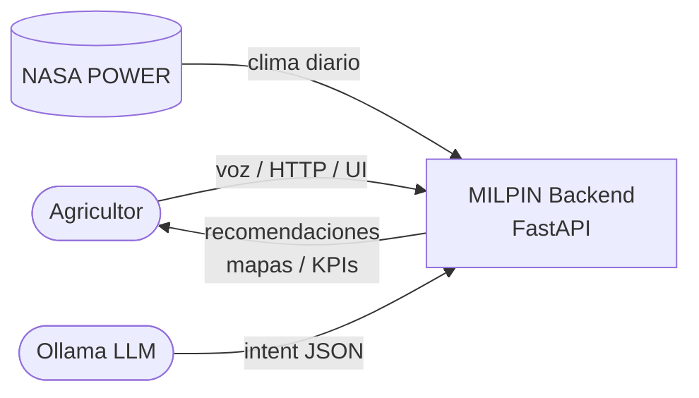
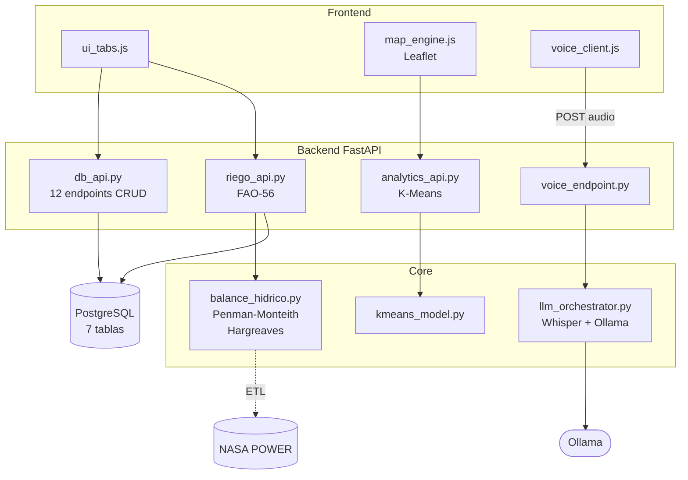
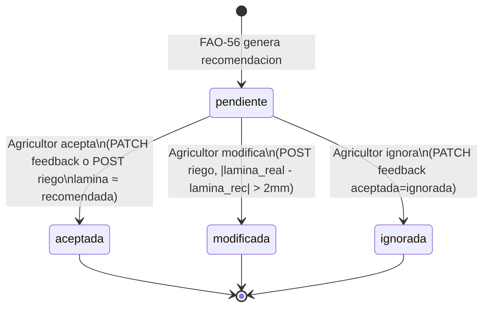
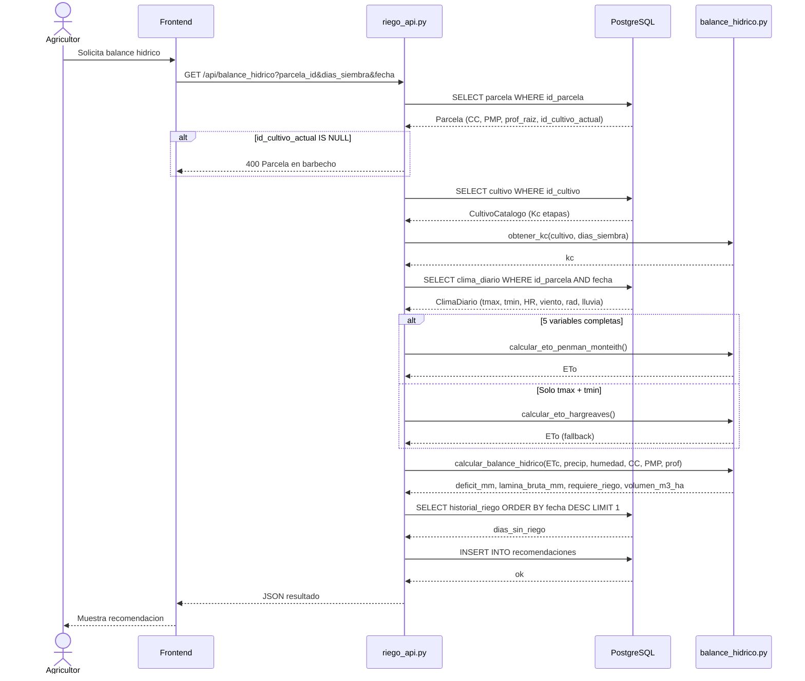
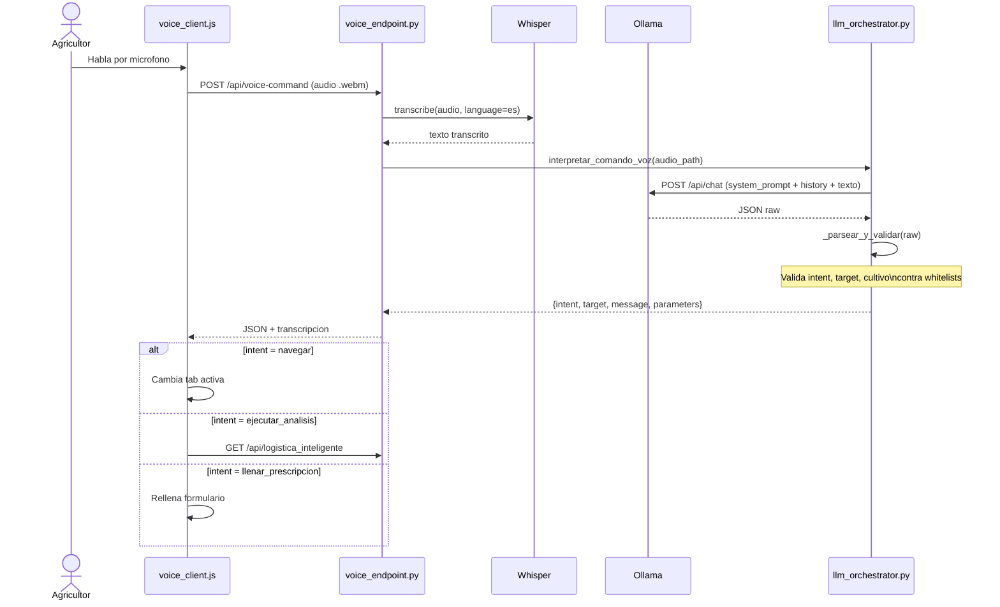

# Diagramas UML — MILPÍN

## 1. DER

```mermaid
erDiagram
    usuarios ||--o{ parcelas : "posee"
    cultivos_catalogo ||--o{ parcelas : "cultivo_actual"
    cultivos_catalogo ||--o{ recomendaciones : "Kc"
    parcelas ||--o{ recomendaciones : "genera"
    parcelas ||--o{ historial_riego : "registra"
    parcelas ||--o{ costos_ciclo : "resume"
    parcelas ||--o{ clima_diario : "serie"
    recomendaciones ||--o{ historial_riego : "origina"

    usuarios {
        uuid id_usuario PK
        string nombre_completo
        string email UK
        string telefono
        string modulo_dr041
        bool activo
        datetime created_at
    }

    cultivos_catalogo {
        uuid id_cultivo PK
        string nombre_comun
        string nombre_cientifico
        numeric kc_inicial
        numeric kc_medio
        numeric kc_final
        numeric ky_total
        int dias_etapa_inicial
        int dias_etapa_desarrollo
        int dias_etapa_media
        int dias_etapa_final
        numeric rendimiento_potencial_ton
    }

    parcelas {
        uuid id_parcela PK
        uuid id_usuario FK
        uuid id_cultivo_actual FK
        string nombre_parcela
        jsonb geom
        numeric area_ha
        string tipo_suelo
        numeric conductividad_electrica
        int profundidad_raiz_cm
        numeric capacidad_campo
        numeric punto_marchitez
        string sistema_riego
        bool activo
    }

    recomendaciones {
        uuid id_recomendacion PK
        uuid id_parcela FK
        uuid id_cultivo FK
        datetime fecha_generacion
        date fecha_riego_sugerida
        numeric lamina_recomendada_mm
        numeric eto_referencia
        numeric etc_calculada
        numeric deficit_acumulado_mm
        int dias_sin_riego
        string nivel_urgencia
        string algoritmo_version
        string aceptada
        numeric lamina_ejecutada_mm
        jsonb parametros_json
    }

    historial_riego {
        uuid id_riego PK
        uuid id_parcela FK
        uuid id_recomendacion FK
        date fecha_riego
        numeric volumen_m3_ha
        numeric lamina_mm
        numeric duracion_horas
        string metodo_riego
        string origen_decision
        numeric costo_energia_mxn
        text observaciones
    }

    costos_ciclo {
        uuid id_costo PK
        uuid id_parcela FK
        string ciclo_agricola
        string cultivo
        numeric volumen_agua_total_m3
        numeric costo_agua_mxn
        numeric costo_fertilizantes_mxn
        numeric costo_agroquimicos_mxn
        numeric costo_semilla_mxn
        numeric costo_maquinaria_mxn
        numeric costo_mano_obra_mxn
        numeric ingreso_estimado_mxn
        numeric margen_contribucion_mxn
    }

    clima_diario {
        uuid id_parcela PK_FK
        date fecha PK
        numeric t_max
        numeric t_min
        numeric humedad_rel
        numeric viento
        numeric radiacion
        numeric lluvia
        numeric et0
    }
```

## 2. DFD (Nivel 0 y Nivel 1)





## 3. Diagrama de Estados — Recomendación



## 4. Casos de Uso

```mermaid
flowchart LR
    AGR([Agricultor])

    subgraph "Gestion de Parcelas"
        UC1(Crear parcela)
        UC2(Consultar parcela)
        UC3(Ver KPI hidrico)
    end

    subgraph "Gestion de Riego"
        UC4(Registrar riego)
        UC5(Ver historial riego)
        UC6(Dar feedback\na recomendacion)
    end

    subgraph "Motor Agronomico"
        UC7(Calcular balance\nhidrico FAO-56)
        UC8(Consultar curva Kc)
    end

    subgraph "Analisis Espacial"
        UC9(Clustering logistico)
        UC10(Zonas de manejo)
    end

    subgraph "Pipeline de Voz"
        UC11(Comando por voz)
    end

    subgraph "Visualizacion GIS"
        UC12(Ver mapa interactivo)
    end

    AGR --- UC1 & UC2 & UC3
    AGR --- UC4 & UC5 & UC6
    AGR --- UC7 & UC8
    AGR --- UC9 & UC10
    AGR --- UC11
    AGR --- UC12

    UC11 -.-> UC7 : include
    UC11 -.-> UC12 : include
    UC7 -.-> UC6 : extend
```

## 5. Diagrama de Secuencia — Balance Hídrico



## 6. Diagrama de Secuencia — Pipeline de Voz


