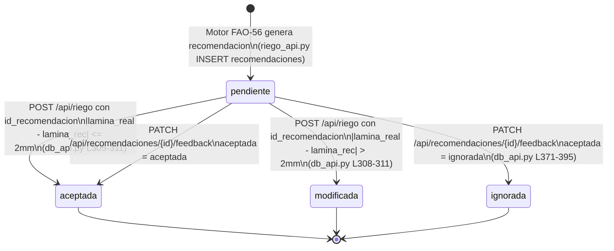
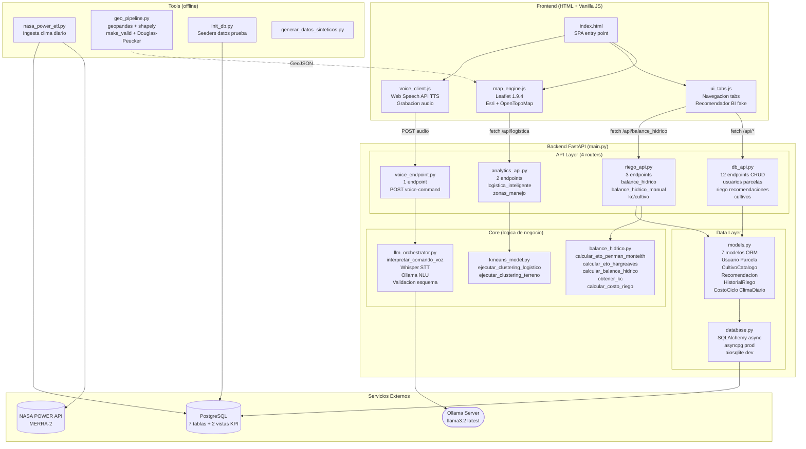

# Diagramas UML — MILPÍN

## 1. Diagrama de Estados — Recomendación de Riego



## 2. Diagrama de Casos de Uso

```mermaid
flowchart LR
    AGR([Agricultor])
    SYS([Sistema MILPIN])

    subgraph "Gestion de Parcelas"
        UC1(Crear parcela)
        UC2(Consultar parcela)
        UC3(Ver KPI hidrico\nvs baseline 8000 m3/ha)
    end

    subgraph "Riego"
        UC4(Registrar evento\nde riego)
        UC5(Consultar historial\nde riego)
        UC6(Dar feedback a\nrecomendacion)
    end

    subgraph "Motor Agronomico FAO-56"
        UC7(Calcular balance\nhidrico)
        UC8(Consultar curva Kc)
        UC9(Calculo manual\nlegacy)
    end

    subgraph "Analisis Espacial K-Means"
        UC10(Clustering\nlogistico)
        UC11(Zonas de\nmanejo)
    end

    subgraph "Voz"
        UC12(Enviar comando\npor voz)
    end

    subgraph "GIS"
        UC13(Ver mapa\ninteractivo Leaflet)
    end

    AGR --- UC1 & UC2 & UC3
    AGR --- UC4 & UC5 & UC6
    AGR --- UC7 & UC8 & UC9
    AGR --- UC10 & UC11
    AGR --- UC12
    AGR --- UC13

    SYS --- UC7
    SYS --- UC8

    UC12 -.-> UC7 : include
    UC12 -.-> UC13 : include
    UC7 -.-> UC6 : extend
    UC4 -.-> UC6 : extend
```

## 3. Diagrama de Procesos — Flujo de Riego Completo

```mermaid
flowchart TD
    A([Agricultor solicita\nbalance hidrico]) --> B{Parcela tiene\ncultivo asignado?}
    B -- No --> C([Error 400\nParcela en barbecho])
    B -- Si --> D[Leer cultivo de\ncultivos_catalogo\nobtener Kc por etapa]

    D --> E[Leer clima_diario\npara parcela y fecha]
    E --> F{Datos climaticos\ncompletos?}

    F -- "5 variables\n(tmax,tmin,HR,viento,rad)" --> G[Calcular ETo\nPenman-Monteith]
    F -- "Solo tmax + tmin" --> H[Calcular ETo\nHargreaves fallback]
    F -- "Sin datos" --> I([Error 404\nSin datos climaticos])

    G --> J[ETc = ETo x Kc]
    H --> J

    J --> K[Calcular balance hidrico\ndeficit, lamina bruta,\nvolumen m3/ha]
    K --> L[Calcular costo\nvolumen x tarifa 1.68 MXN/m3]
    L --> M[Consultar dias\nsin riego]
    M --> N{Deficit > 20mm?}

    N -- Si --> O[Urgencia: critico]
    N -- No --> P{Deficit > 8mm?}
    P -- Si --> Q[Urgencia: moderado]
    P -- No --> R[Urgencia: preventivo]

    O & Q & R --> S[INSERT recomendacion\nen BD con snapshot\nde parametros]

    S --> T([Retorna JSON\ncon recomendacion])

    T --> U{Agricultor\nresponde?}
    U -- "Riega segun\nrecomendacion" --> V[POST /api/riego\ncon id_recomendacion]
    U -- "Modifica lamina" --> V
    U -- "Ignora" --> W[PATCH feedback\naceptada = ignorada]

    V --> X{|lamina_real -\nlamina_rec| > 2mm?}
    X -- Si --> Y[Estado: modificada\nregistra lamina_ejecutada_mm]
    X -- No --> Z[Estado: aceptada]

    W & Y & Z --> AA([Fin del ciclo])
```

## 4. Diagrama de Componentes


